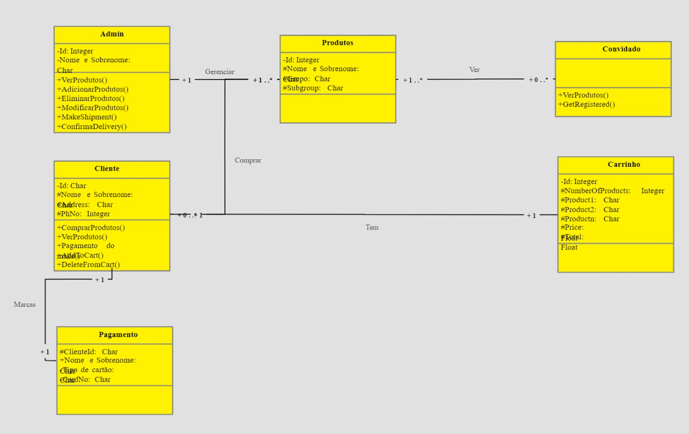
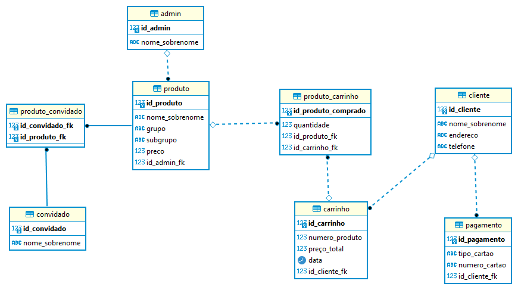

# BANCO DE DADOS APLICADO: POSTGRESSQL E DBEAVER
Essa aplicação será realizada utilizando o DBeaver como interface para se conectar ao PostgreSQL.

## Objetivo:
O objetivo é utilizar o conhecimento adquirido na disciplina Banco de Dados Aplicado para criar e organizar adequadamente o esquema do banco de dados no PostgreSQL por meio do DBeaver.
Deverão ser aplicados os conceitos de DDL (Data Definition Language), os comandos serão empregados para definir a estrutura do banco de dados, incluindo tabelas e outros elementos.

## Diagrama de Classe:
A proposta deverá ser desenvolvida utilizando como base o seguinte Diagrama de Classe:

## Contexto
Trata-se de um sistema de Ecommerce que será usado para gerenciar:
- **Admnistrador**: Tabela responsável por armazenar informações do administrador.
- **Produto**: Tabela responsável por armazenar informações dos produtos.
- **Cliente**: Tabela responsável por armazenar informações dos clientes.
- **Carrinho**: Tabela responsável por armazenar informações dos carrinhos.
- **Pagamento**: Tabela responsável por armazenar informações dos pagamentos.
- **Convidado**: Tabela responsável por armazenar informações dos convidados.

## Diagrama Entidade Relacionamento:

